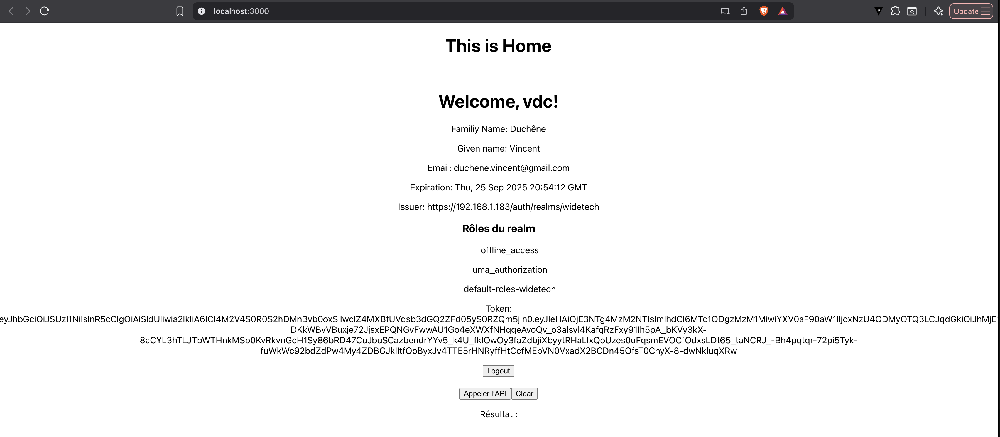

# Configuration

Keycloak condfiguration is defined in the file keycloak.js

```javascript
const keycloak = new Keycloak({
 url: 'https://192.168.1.183/auth',
 realm: 'widetech',
 clientId: 'wide',
 credentials: 'omit'
});
```
Add usage of KeycloakProvider in index.js file

```javascript
const root = ReactDOM.createRoot(document.getElementById('root'));
root.render(
  <ReactKeycloakProvider authClient={keycloak} initOptions={{ onLoad: 'login-required', checkLoginIframe: 'true' }}>
    <App />
  </ReactKeycloakProvider>
);
```

# Result



# Getting Started with Create React App

This project was bootstrapped with [Create React App](https://github.com/facebook/create-react-app).

## Available Scripts

In the project directory, you can run:

### `npm start`

Runs the app in the development mode.\
Open [http://localhost:3000](http://localhost:3000) to view it in your browser.

The page will reload when you make changes.\
You may also see any lint errors in the console.

### `npm test`

Launches the test runner in the interactive watch mode.\
See the section about [running tests](https://facebook.github.io/create-react-app/docs/running-tests) for more information.

### `npm run build`

Builds the app for production to the `build` folder.\
It correctly bundles React in production mode and optimizes the build for the best performance.
